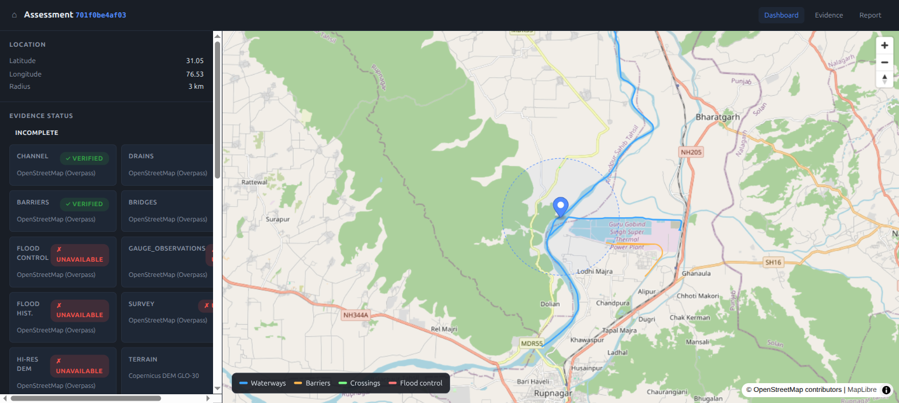

# Location Hazard Intelligence Engine

A local-first geospatial application that analyzes a given geographic coordinate
and determines its potential exposure to flooding and water-related hazards.



**Status:** V0.1 (Terrain + Hydrology + Basic Flood Exposure)

## ⚠️ Disclaimer

This is a decision-support/research tool, **not** an emergency warning system
and **not** a replacement for government flood models, engineers, hydrologists,
or disaster-management authorities.

Modelled values must never be presented as exact real-world predictions.

## V0.1 Scope

Accepts a lat/long and an analysis radius and produces:

- Point elevation, slope, aspect, relief
- Nearby rivers / streams / lakes / reservoirs / dams (from OpenStreetMap)
- Basic watershed/flow-direction from DEM
- Historical-flood dataset availability note
- Transparent preliminary flood-exposure score with confidence

Explicitly **OUT of scope for V0.1**:

- Exact dam-break water depth / velocity / arrival time
- Real hydraulic simulation (HEC-RAS, LISFLOOD, etc.)
- Real probability of disaster
- Emergency evacuation instructions

## Quick Start

### Backend (FastAPI)

```bash
cd apps/api
python -m venv .venv && source .venv/bin/activate
pip install -r requirements.txt
cp ../../.env.example ../../.env
uvicorn main:app --reload --port 8000
```

### Frontend (Next.js)

```bash
cd apps/web
npm install
npm run dev
```

### Tests

```bash
cd apps/api
pytest
```

## Architecture

See [`docs/PROJECT_SPEC.md`](docs/PROJECT_SPEC.md) for the full V0.1 specification
and [`docs/DATA_SOURCES.md`](docs/DATA_SOURCES.md) for external data providers.

```
disaster-management/
├── apps/
│   ├── api/         FastAPI backend
│   └── web/         Next.js frontend
├── packages/geo/    Geospatial algorithms (provider-agnostic)
├── data/            raw / processed / cache / samples
├── simulations/     scenario outputs (future)
├── tests/
├── scripts/
├── docs/
└── docker/
```

## Engineering Rules

1. Never hardcode geographic conclusions.
2. Never fabricate missing elevation or river geometry.
3. Never claim a dam is hydraulically connected just because it is nearby.
4. Never call an exposure score a probability of disaster.
5. Every result identifies its data/model source.
6. Providers are replaceable behind interfaces.
7. LLM (future) explains results — it does not invent physics.